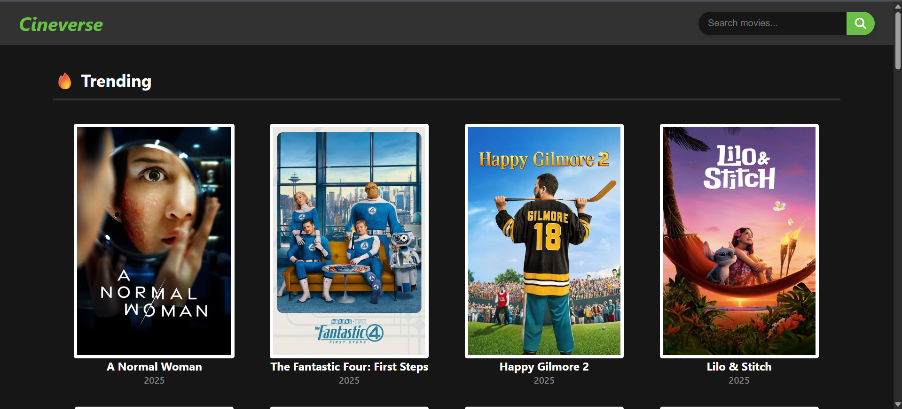
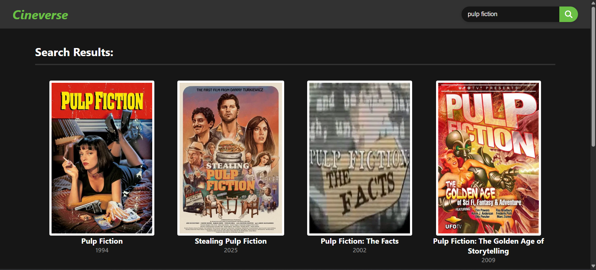
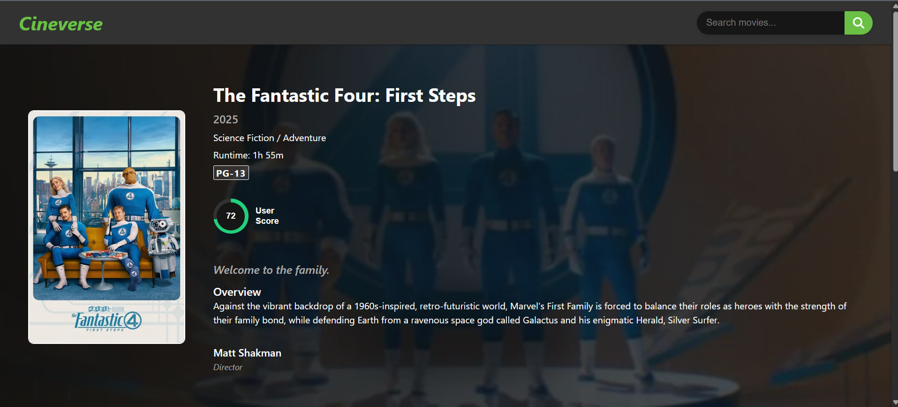
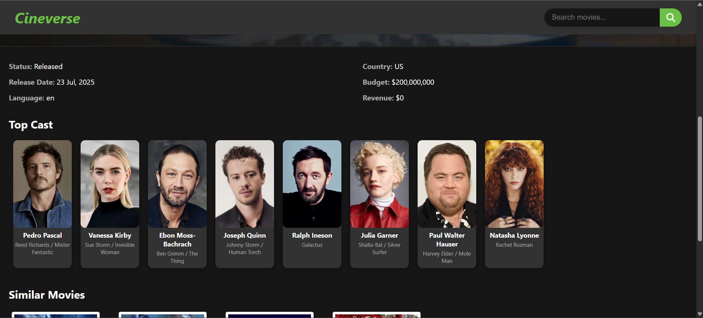
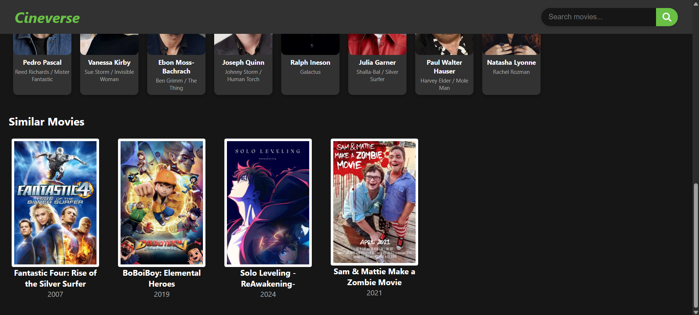

# 🎬 Cineverse

**Cineverse** is a fully responsive movie discovery web app built using HTML, CSS, and JavaScript, powered by [The Movie Database (TMDB)](https://www.themoviedb.org/) API. It features a secure Node.js reverse proxy server to handle API requests and keep the TMDB token hidden from the frontend.

<br>

##  Live Demo

Try it out here: [cineverse-moviehub.vercel.app](https://cineverse-moviehub.vercel.app/) 

>  The frontend interacts **only** with the proxy server. TMDB credentials are never exposed to the client.

---

## 📸 Screenshots

### 🎬 Homepage 


### 🔍 Search Page


### 🎥 Movie Details Page




---

##  Project Structure

```
CineVerse/
├── client/   # Frontend static site (HTML, CSS, JS)
│ ├── assets/
│ │ └── placeholder-poster-image.jpg   # Fallback image for missing posters
│ ├── index.html    # Homepage displaying trending, popular, top-rated, and upcoming movies
│ ├── movie.html    # Movie details page
│ ├── search.html   # Search results page
│ ├── scripts/
│ │ ├── config.js     # Stores base URLs and endpoint paths
│ │ ├── header.js     # Script for search header behavior
│ │ ├── home.js       # Handles homepage movie sections
│ │ ├── movie.js      # Handles movie details rendering
│ │ ├── search.js     # Handles search results rendering
│ │ └── tmdb-utils.js # Contains utility functions for API calls to proxy server
│ └── styles/
│ ├── base.css          # Global styles
│ ├── header.css        # Styles for the header/search bar
│ ├── movie-details.css # Styles for movie details page (movie.html)
│ └── movies.css        # Grid layout styling for movie gird and cards
├── README.md   # Project documentation
├── server/     # Node.js reverse proxy backend
│ ├── index.js           # Main server file to start Express app
│ ├── package.json       # Node dependencies and metadata
│ ├── package-lock.json  # Exact versions of installed dependencies
│ ├── routes/
│ │ ├── genre.js        # API route for fetching genres
│ │ ├── movie-list.js   # API route for movie lists (popular, trending, etc.)
│ │ ├── movie.js        # API route for movie details
│ │ └── search.js       # API route for searching movies
│ └── utils/
│ └── tmdbClient.js   # Axios setup with retries and TMDB token handling
└── .gitignore     # Specifies files/folders to ignore in Git
```
---

## Features
- ### Movie Data Powered by TMDB
  Displays trending, top-rated, popular, and upcoming movies using The Movie Database (TMDB) API.
- ### Search Functionality
  Search for movies by title and view results in a responsive grid layout.
- ### Detailed Movie Pages
  View complete movie details including:
  -Poster and backdrop images
  -Title, release year, tagline, genres, runtime, and PG certification
  -User score, overview, and director
  -Cast (with profile pictures and character names)
  -Similar movies

- ### Reverse Proxy Server (Node.js)
  A backend server acts as a reverse proxy to:
  - Hide TMDB API Bearer token
  - Retry failed requests using exponential backoff (axios-retry)
  - Prevent CORS issues on the frontend

- ### Responsive Design
  Fully responsive UI that works seamlessly on desktop and mobile devices.

---

## Technologies Used

### Frontend:
- HTML5, CSS3
- JavaScript (Vanilla)
- Hosted on **Vercel**

### Backend:
- Node.js
- Express
- Axios + Axios Retry
- Hosted on **Render**

---

##  API Proxy Endpoints

The frontend requests data from backend proxy using the following endpoints:

###  Movies
- `GET /api/movie/:movieId` — Get full details of a movie by ID
- `GET /api/movie/:movieId/release_dates` — Get release dates and certification for different regions of a movie
- `GET /api/movie/:movieId/credits` — Get cast and crew details
- `GET /api/movie/:movieId/similar` — Get a list of similar movies

###  Lists
- `GET /api/list/movie/trending` — Get a list of trending movies
- `GET /api/list/movie/popular` — Get a list of popular movies
- `GET /api/list/movie/top_rated` — Get a list of top rated movies
- `GET /api/list/movie/upcoming` — Get a list of upcoming movies


###  Search
- `GET /api/search/movie?query` — Search movies by keyword

###  Genres
- `GET /api/genre/movie` — Get the official list of movie genres (with name and id) from TMDB

---

##  Getting Started
### Local Setup

 **Open a terminal and clone the repo**
  ```shell
  git clone https://github.com/PrathB/CineVerse
  cd CineVerse
  ```

###  Backend (Proxy Server)
1. Navigate to the server directory:
   ```shell
   cd server
   ```
2. Install dependencies:
   ```shell
   npm install
   ```
3. Create a .env file:
   ```shell
   touch .env
   ```
   Add your TMDB API read access token in the .env file:
   ```shell
   TMDB_API_BEARER_TOKEN=your_tmdb_bearer_token
   ```
   Add a port number in the .env file (optional):
   ```shell
   PORT = 3001
   ```
4. Start the server locally:
   ```shell
   npm start
   ```

### Frontend (Static Website)
1. Navigate to the client directory:
   ```shell
   cd ../client
   ```
2. Add your local deployed server url in `config.js`:
   ```shell
   const PROXY_API_BASE_URL = "localhost:3001";
   ```
3. Open index.html in your web browser
   
---

## Deployment
- Frontend: Deployed to Vercel
    - Root: client/

- Backend: Deployed to Render
    - Root: server/
    - Start command: npm start

---

## License
MIT — feel free to use and customize!

---
